# SpideyHub

A tmux-emulated personal portfolio site — a real terminal client (sessions,
windows, panes, prefix keys, splits/layouts, copy-mode, a host shell) built
from scratch in Astro + Svelte 5, skinned as a Spider-Verse-themed ops
console. Every window is a real page (`Repositories`, `Employment Records`,
`Profile`, `Retina-V`, `Help`) reachable by mouse, `Ctrl-b <n>`, or shell
commands — not a single-page illusion with fake navigation.

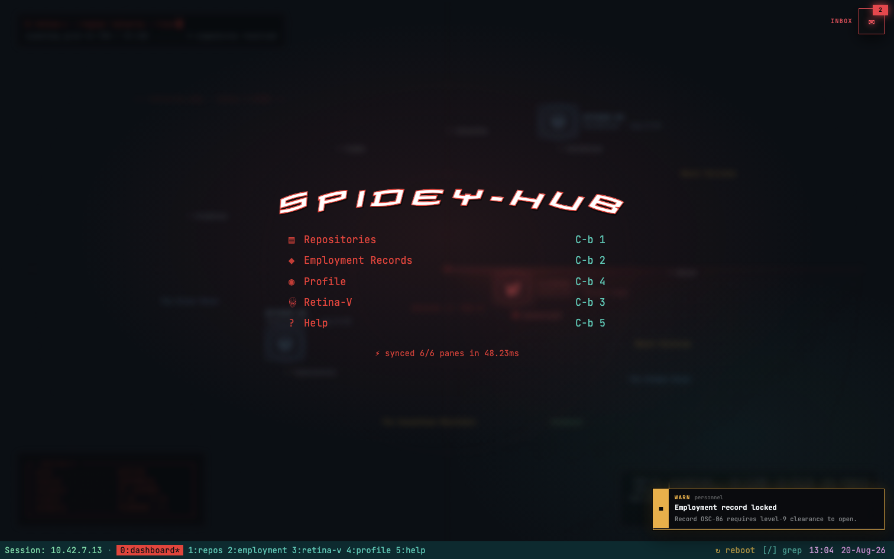

## Quickstart

```sh
pnpm install
git submodule update --init --recursive   # the 8 Repositories projects are real submodules
pnpm dev                                   # http://localhost:4321
```

Full command reference, the test matrix, and the `GITHUB_TOKEN` role: see
[`docs/how-to-run.md`](docs/how-to-run.md). Repo layout and the
content/data/generated convention: [`docs/project-structure.md`](docs/project-structure.md).
Stack, coding standards, and testing gates: [`docs/architecture.md`](docs/architecture.md).

## Key Features

### Absolute Web-Slinger!

| feature | what it does |
|---|---|
| Real tmux prefix-key model | `Ctrl-b` arms a 2-second prefix window, then dispatches to a real client model — sessions, windows, panes, 7 layout presets (`Ctrl-b Space`), splits, directional pane nav, rename/kill with real tmux confirm-key quirks reproduced deliberately |
| Pixel-identical visual regression pipeline | 21 recipes × 2 viewports = 42 self-baselined goldens (`tests/visual/`), gated at `maxDiffPixels: 0`, that caught real regressions during a live component refactor |
| Generate-time syntax highlighting | Every source file byte the site can show is tokenized once with Shiki at `pnpm generate` time (`src/lib/highlight.ts`) — zero runtime highlighter ships to the browser |
| Live GitHub data, build-time resolved | The contribution grid and commit panes hit the real GitHub API at build time through a GraphQL → HTML-scrape → last-known-good-snapshot fallback chain, then do their own silent client-side refresh |
| Shared vim-lite modal editor engine | NORMAL / VISUAL / VISUAL-LINE, counts, motions, yank/search, in-buffer `/` — one engine (`src/lib/vim.ts`) backing both Repositories' and Employment Records' file viewers |

### thwip-tastic

| feature | what it does |
|---|---|
| In-browser shell + host shell | A pane-local shell with real builtins (`cd`/`ls`/`cat`/`tree`/`neofetch`/`sudo`…) plus a fullscreen host shell reachable via `Ctrl-b d` with real `tmux ls`/`new`/`a` session management |
| Grep overlay | `/` opens a live fuzzy search over the site's own generated source index — searches the actual codebase the site is built from, not a canned dataset |
| Notification system | Toasts, a sense-ring bell indicator, a header sweep animation, and pool-exhaustion re-circulation (an exhausted unseen pool re-injects the oldest archived non-spam entry, unread, with a fresh toast) |
| E.D.I.T.H boot sequence | An elapsed-time-driven boot animation (rings, progress, phase, log, handshake) that plays once per tab and replays on `r` |
| Copy-mode | `Ctrl-b [` opens a vim-navigable text-selection overlay over *any* active pane — editor buffer, a panel, a shell's scrollback, even the dashboard menu |
| Floating Cmdline + HelpSearch | A noice.nvim-style `:` command box (Tab-completion, no suggestion list) and a site-wide `?` fuzzy palette that searches commands, keymap rows, and shell builtins together |

### Solid

| feature | what it does |
|---|---|
| Content collections + Zod | 7 Markdown collections, each schema-validated at build time — a bad frontmatter edit fails the build, not a visual review |
| Fixture mode | `PORTFOLIO_FIXTURES=1` swaps in deterministic sample content so the visual suite never couples goldens to real, ever-changing project data |
| Material icons at generate time | File-type icons are resolved once by `pnpm generate` (`material-file-icons`), not re-computed per render |
| 908-run e2e suite | 454 Playwright tests × 2 viewports, across 21 spec files, run against a real production build |
| Folder + state-class components | Every non-trivial view is an orchestrator + one `$state` class + panel children — no context, no stores, no ad hoc state machines |
| Desktop-gated, no broken mobile experience | A `matchMedia` guard blocks the whole terminal below 900px/no-fine-pointer with an honest "this needs a desktop" card instead of a broken layout |

## Accomplishments

- I built a pixel-identical visual regression pipeline — 42 self-baselined goldens across 2 viewports at `maxDiffPixels: 0` — and used it as the safety net for relocating four monolithic view components (Repositories, Editor, Notifications, Terminal) into a folder + state-class architecture with zero visual drift, then separately rebuilt a fifth (Employment Records) against a deliberate, reviewed re-baseline.
- I implemented a real tmux client model from scratch: prefix-key arming, panes, 7 layout presets, session/window management, and a choose-tree overlay, faithful enough to real tmux that its own quirks (case-sensitive vs. case-insensitive kill confirms, nested-session protection) are reproduced on purpose, not accidentally.
- I wrote a shared vim-lite modal text-editing engine (NORMAL/VISUAL/VISUAL-LINE, counts, motions, yank, in-buffer search) as pure, DOM-free logic, unit-tested independently of any component that uses it.
- I designed a build-time data pipeline that resolves live GitHub contribution and commit data through a 3-way fallback chain (authenticated GraphQL → public HTML scrape → last-known-good snapshot), so the site never fails to render live-looking data even against an unauthenticated rate limit.
- I moved syntax highlighting entirely out of the client: source files are tokenized once at generate time with Shiki and shipped as static markup, so viewing a file costs zero runtime highlighting JavaScript.
- I grew the test suite to 908 end-to-end runs and 335 unit tests across two viewports, and gated every change behind four independent, all-green suites (types, unit, e2e, visual) before it could ship.
- I executed a sitewide rename (`builds` → `repositories`, "Personnel Files" → "Employment Records") across routes, content collections, test suites, and copy with zero stale references left behind — verified by repo-wide grep, not assumption.
- I structured all content into three explicit tiers — Zod-validated Markdown for anything record-like, YAML for UI chrome, generated JSON for anything machine-computed — so where a given string lives is never a guess.

## Key Pages

### Dashboard

The landing view — a status plate, a menu of every window with its `Ctrl-b`
key hint, a live network meter, and a seeded notification toast pair. The
front door to every other surface below.


### Notification Inbox

A bell-triggered panel over the dashboard listing unread/read/archived
notifications, backed by a seeded pool that re-circulates its oldest
archived entry once every unseen notification has been shown.

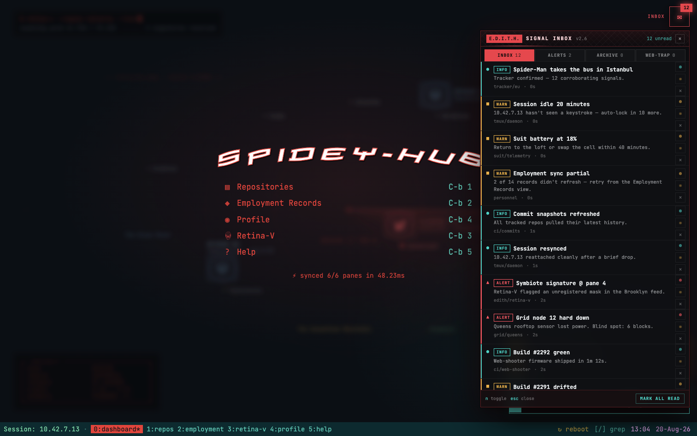

### Repositories

A lazygit-style panel layout (`0 · Status` through `5 · Command Log`) over 8
real git submodules plus a virtual `all-projects` doc browser — live
contribution grid, real commit history, a file tree with syntax-highlighted
previews, and a Markdown-authored command log.

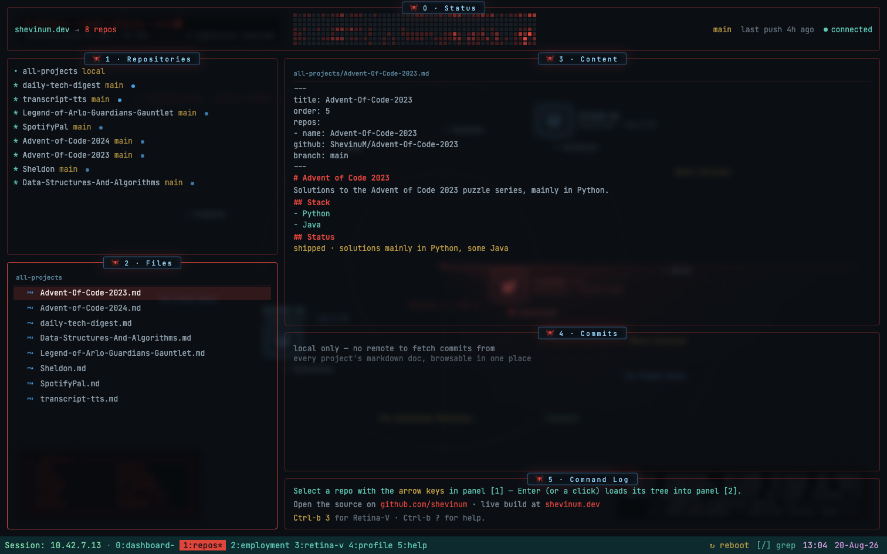

### Employment Records

A flat, newest-first list of every role, paired with a spiderweb-and-spine
timeline that tracks the selected row and a derived index block (org count,
longest tenure, years active) computed straight from the content collection.

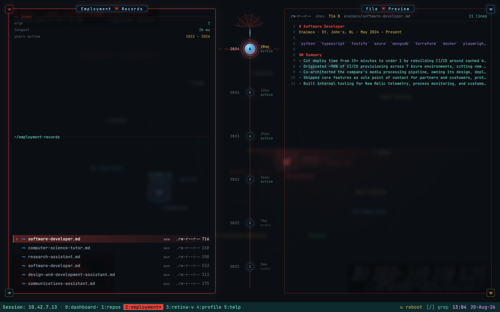

### Profile

A dossier-styled bio page — contact rows, education, a résumé download, and
a live SIGNAL network-latency readout.

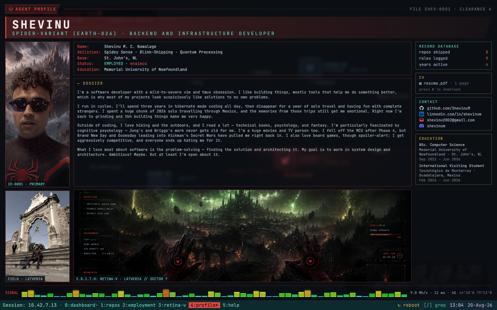

### Help

The full keymap reference, rendered from the exact same Markdown scope files
the site's `?` HelpSearch palette searches — one source, two surfaces, never
out of sync.

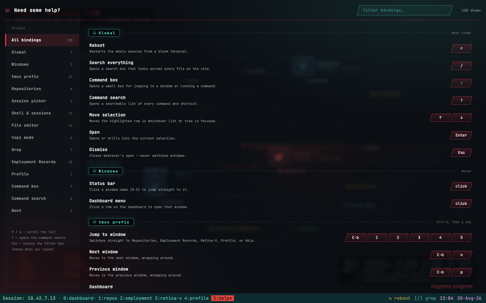

### Terminal surfaces

Every window shares the same terminal chrome and the same overlay set below,
reachable from anywhere via the tmux prefix or a bare key.

**Shell** — an in-window or fullscreen host shell with real builtins
(`cd`/`ls`/`cat`/`tree`/`neofetch`/`sudo`…) and `tmux ls`/`new`/`a` session
management.

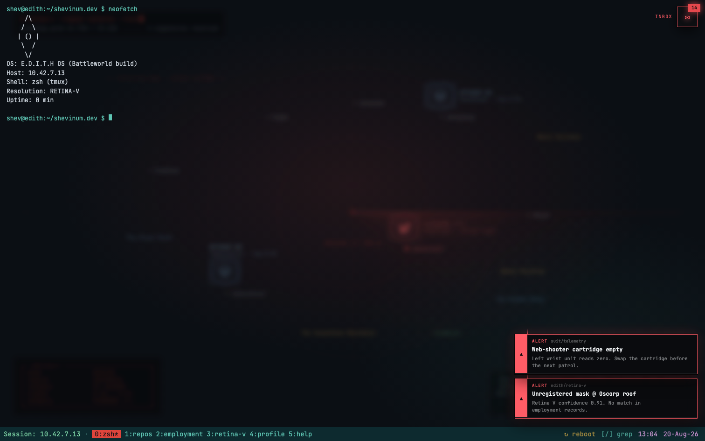

**Editor** — the shared vim-lite modal engine, opened on any file from
Repositories or Employment Records: NORMAL/VISUAL/VISUAL-LINE, motions,
counts, yank, in-buffer search.

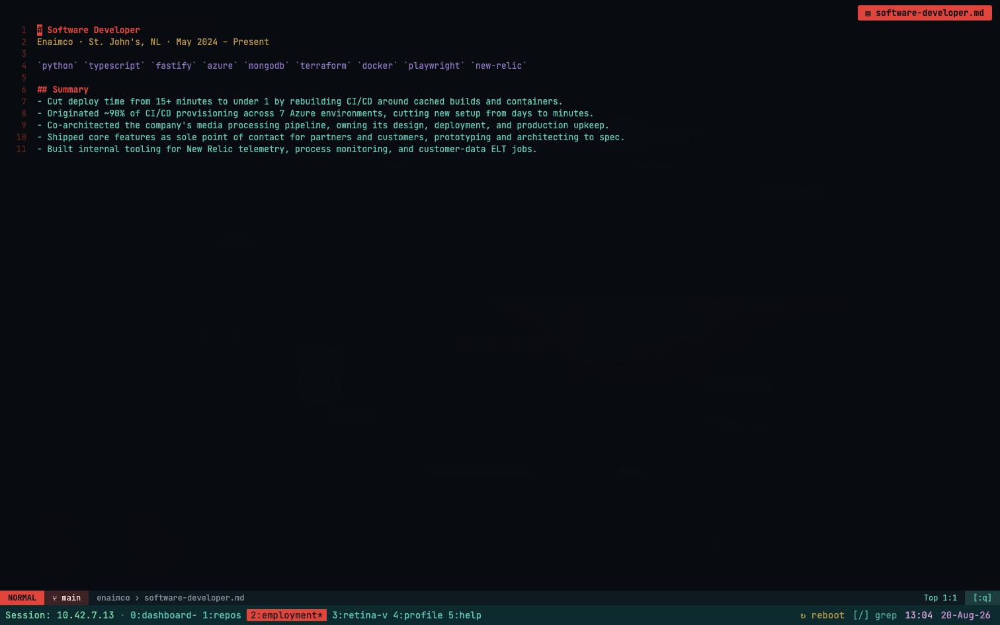

**Grep overlay** — a live fuzzy search (`/`) over the site's own generated
source index, routing a hit straight to the view that owns it.

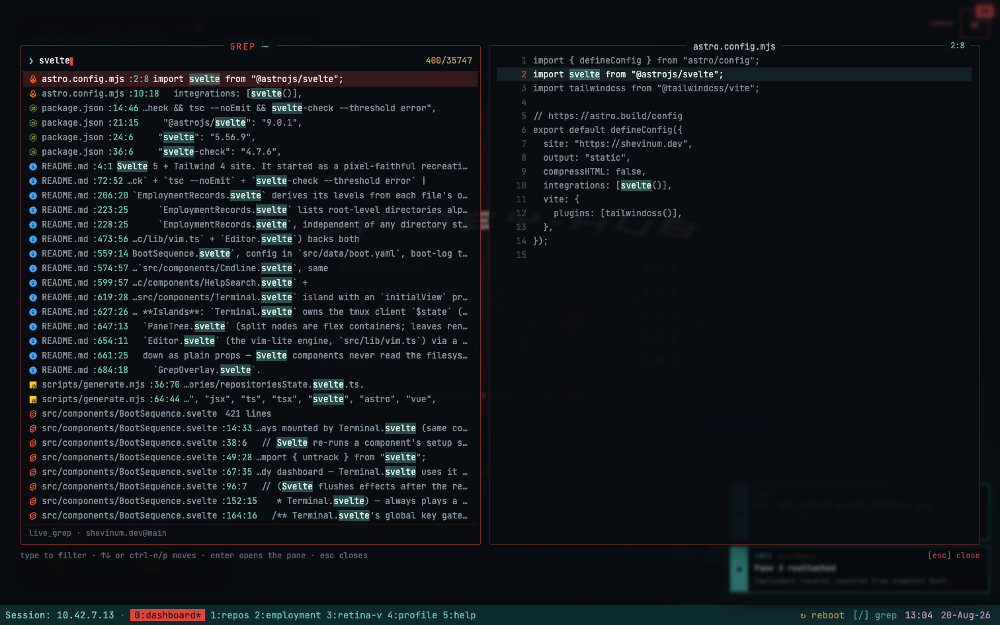

**Session picker** — `Ctrl-b w`'s choose-tree overlay: every session and
window in one navigable, killable list.

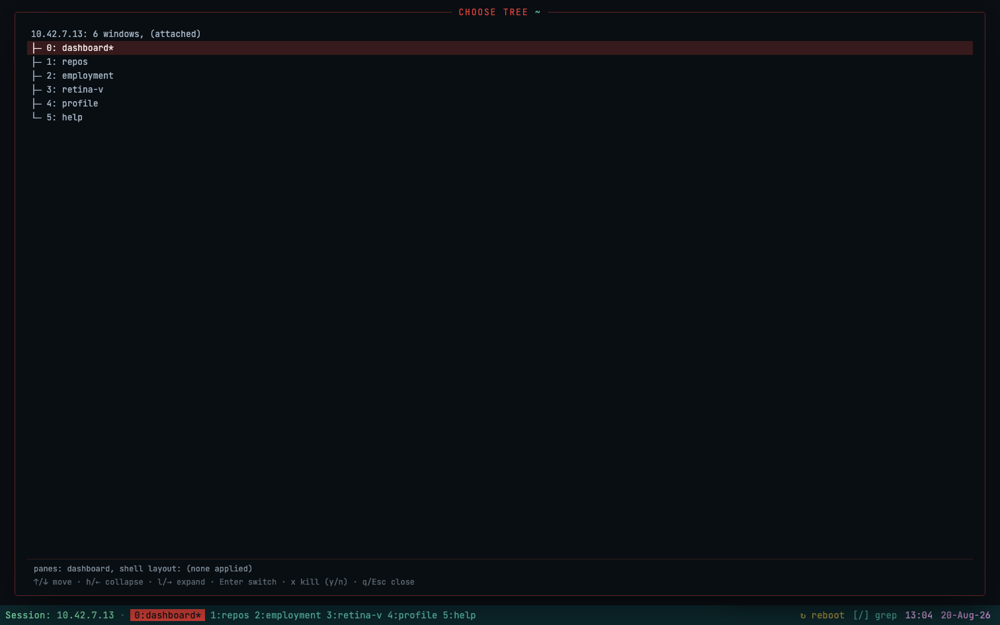

**Copy mode** — `Ctrl-b [` opens a vim-navigable text-selection overlay over
whatever pane is focused; `y`/`Enter` yanks to a paste buffer `Ctrl-b ]`
pastes back into any input.

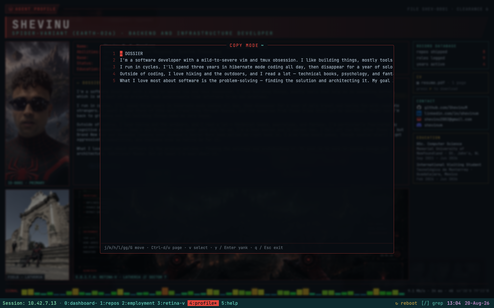

**Boot sequence** — an E.D.I.T.H-branded, elapsed-time-driven boot animation
that plays once per tab before the dashboard appears, and replays on `r`.

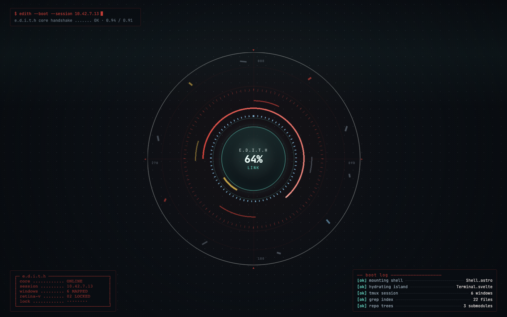

## Keymap reference

**Single source of truth**: `src/content/help/*.md` — the app's own Help
window (`Ctrl-b 5`, a status-bar click on "5:help", or the `?` palette)
renders exactly this content, so it and this table are reviewed together
whenever a binding changes. Bare `q`/Esc never switch the active view
anywhere — Esc only ever exits whatever's currently open.

### Global

| key | action |
|---|---|
| `Ctrl-b` then a key | tmux prefix — window jumps, splits, layouts, sessions, copy-mode (see below) |
| `?` | open the fuzzy HelpSearch palette from any view |
| `/` | open the grep overlay (inside an editor, searches the open buffer instead) |
| `:` | open the floating Cmdline box (an editor's own ex-command line, when one is open) |
| `r` | reboot — replays the boot sequence and factory-resets the client |
| `Enter` | open / drill in; arrows/`j`/`k` move selection within the focused panel |

### tmux prefix (`Ctrl-b`)

| key | action |
|---|---|
| `0`–`5` | jump straight to dashboard / Repositories / Employment Records / Retina-V / Profile / Help |
| `n` / `p` | next / previous window |
| `w` | choose-tree — every session/window, navigable and killable |
| `d` | detach to the fullscreen host shell |
| `,` / `&` / `x` | rename-window / kill-window / kill-pane, each with a status-bar confirm prompt |
| <code>&#124;</code> / `-` | split horizontally / vertically |
| `o` / `;` | next pane / last-focused pane |
| arrows | directional pane nav |
| `Space` | cycle the 7 preset layouts |
| `[` / `]` | copy-mode / paste the last yank |
| `:` | tmux command-prompt mode (`rename-window`, `kill-window`, `select-window`, `select-layout`, …) |

### Repositories (`Ctrl-b 1`)

Panels `0 · Status` (contribution grid + repo count) through `5 · Command
Log`, digit keys `0`–`5` to focus a panel, arrows to move selection. Panel
`1`'s repo selection drives panel `4`'s commit list; a file in panel `2`
opens in the shared editor on `Enter`.

### Employment Records (`Ctrl-b 2`)

A flat, newest-first row list (`j`/`k`/arrows/`Enter`) with a live index
block (orgs / longest tenure / years active) and a timeline column that
tracks the selected row.

Full per-view detail (Profile, Help, Cmdline, HelpSearch, the vim editor,
copy-mode, the grep overlay, and every shell builtin) lives in
`src/content/help/*.md` and the in-app Help window — kept there instead of
duplicated here so there's exactly one place that can go stale.

## Content workflows

Nothing in `src/components/**` should ever need editing to change what the
site *says*, only what it *does*. See
[`docs/project-structure.md`](docs/project-structure.md) for the full
content vs. data vs. generated convention.

### Add a Repositories project

1. Add the upstream repo as a submodule: `git submodule add <url> repos/<name>`.
2. Add `src/content/repositories/<name>.md` with frontmatter matching the
   `repositories` schema (`title`, `order`, `repos: [{name, github, branch}]`)
   — see any existing file in that directory for the body shape.
3. `pnpm generate` to refresh the repo index, commit snapshot, and grep index.
4. Commit the submodule addition, the content file, and the regenerated
   `public/generated/repos/*.json` + `src/generated/commits/*.json`.

### Add an Employment Records role

Add `src/content/personnel/<org-slug>/<role-slug>/role.md` — exactly that
depth (2 path segments under `personnel/`) — with frontmatter matching the
`personnel` schema: `role`, `dates`, `loc`, `order` (ascending order = 0 is
newest; the flat list sorts on start date, `order` breaking ties — no
company/employment-type grouping fields needed). Only org-level files at
that exact depth render as a row; a deeper `.../<role-slug>/<sub-role>/
role.md` file (used today for enaimco's full-time/part-time/co-op split) is
valid content but is not currently reachable from this page — see
`employmentRecordsState.svelte.ts`'s own comment for the full rationale.
`pnpm generate` afterward keeps the grep index in sync.

## Mobile policy

The terminal only ever mounts on a desktop-class viewport: a
`window.matchMedia('(min-width: 900px) and (pointer: fine)')` guard blocks
everything else. Below that threshold the page shows a plain card
("Retina-V" heading, "viewport too small — this session requires a desktop
terminal (≥900px)." body copy, a `github.com/shevinum` escape-hatch link)
and **no keydown listener, timer, or animation ever starts** — not a hidden
terminal, a genuinely inert one. This is verified in
`tests/e2e/tmux.spec.ts`'s `mobile block` suite.

## Testing

Four independent gates — types, unit, e2e, visual — all run against every
change; see [`docs/architecture.md`](docs/architecture.md) for what each one
covers and the golden re-baseline policy, and
[`docs/how-to-run.md`](docs/how-to-run.md) for exact commands. The visual
suite's full capture-order rationale and re-baseline history live in
[`tests/visual/README-PIPELINE.md`](tests/visual/README-PIPELINE.md).

## Deploy

This is a fully static site (`astro build`, `output: "static"`) — the
entire `dist/` directory produced by `pnpm build` can be served by any
static file host; there's no server-side runtime to provision. **No CI is
configured in this repository** — deployment is a manual `pnpm build` +
upload/sync of `dist/`. If you wire up CI later, remember it needs to `git
submodule update --init --recursive` before `pnpm install`/`pnpm build`,
since the 8 Repositories projects are real git submodules, not vendored
copies.
